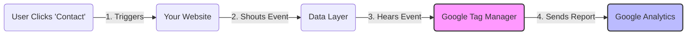

# How Your Tracking Works

Here is the "Big Picture" of what we are building.

## The Data Flow

## The Components

### 1. Your Website (The Source)
*   **What it does**: We added `tracking.js`. It watches for clicks on buttons like "LinkedIn" or "View Work".
*   **The Action**: When clicked, it puts a message in the **Data Layer** (a hidden bucket in the browser).
*   **Status**: ✅ **Done**.

### 2. Google Tag Manager (The Middleman)
*   **What it does**: It sits on your site and watches that "Data Layer" bucket.
*   **The Job**: When it sees a message, it packages it up and sends it to Google Analytics.
*   **Status**: ⚠️ **Needs Configuration**. It needs to know *where* to send the data.

### 3. Google Analytics 4 (The Dashboard)
*   **What it does**: This is where you see the graphs and reports.
*   **The ID**: It has a unique address called a **Measurement ID** (starts with `G-`).
*   **Status**: ❌ **Missing Link**. GTM doesn't know this ID yet.

## Why do we need the ID?
Imagine GTM is a mailman. He has the letter (the click data), but he doesn't know the address (the Measurement ID) to deliver it to. Once you paste that ID into GTM, the mail gets delivered.
